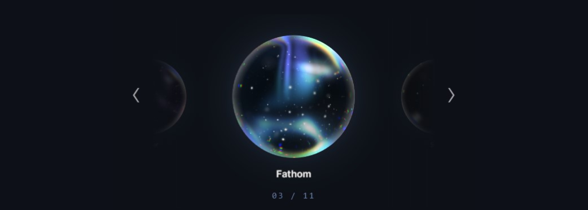

<div align="center">
  
</div>


# orb-of-fate

An original, dependency-free* WebGL / GLSL ES 1.00 study of a glassy star-orb carousel.

## Run it

From this folder, start any static HTTP server. For example:

```powershell
python -m http.server 4173
```

Then open <http://localhost:4173>.


## Rendering notes

- No Three.js, image textures, build step, or framework is required.
- Each orb is a square canvas with a raw WebGL context and the imported hero vertex/fragment pass in `high-quality-shaders.js`.
- The hero fragment shader reconstructs a dual-layer glass sphere, deterministic galaxy starfields, nebula pockets, Fresnel lighting, and a refracted back wall.
- Its in-shader lens evaluates separate RGB offsets at the rim for the chromatic dispersion effect; the CSS layer only adds a restrained highlight.
- Aster and Vesper use a subdued star census so their static pinpoints stay readable without competing with the animated shooting-light accents.
- WebGL is required; there is deliberately no CSS or image fallback so the result stays a real shader study.

## Reference inspection

The carousel UI is local to this folder; the hero GLSL is in `high-quality-shaders.js`, with the renderer wiring in `main.js`.
